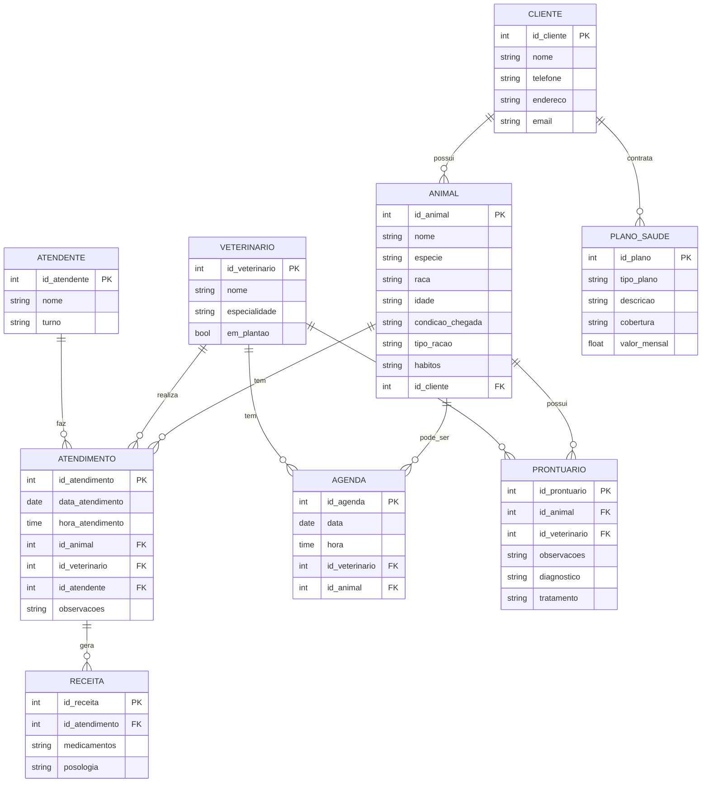

# Nicoly_Fiorindo

Sistema para clinica veterinária...
Autor: Nicoly Samara Fiorindo

# 1. Descrição do sistema para clínica veterinária...

Nome da clínica:
Melissa pets

1. Uma clínica veterinária atende apenas os animais: gatos e cachorros. 
2. Os clientes devem fazer um cadastro de si e dos animais. 
3. Os clientes devem informar as condições nas quais os animais chegam. 
4. Os clientes devem informar o tipo de ração que o animal come. 
5. O cliente deve informar hábitos do animal. 
6. Para cada animal é possível que mais de um veterinário o atenda. 
7. Os animais podem chegar e serem atendidos de acordo com uma agenda do dia. 
8. Cada animal atendido receberá uma ficha e um prontuário. 
9. Outros donos podem querer marcar horários de atendimento futuro. 
10. O atendimento gera uma receita para o animal. 
11. Quando um cliente chega na clínica veterinária ele é atendido por um atendente. 
12. O atendente deve verificar se existe agenda disponível com um veterinário. 
13. O atendente deve colocar o cliente e seu animal na fila de espera, se for o caso. 
14. O atendente deve levar o cliente e o animal até o veterinário. 
15. O veterinário deve realizar uma entrevista com o dono do animal. 
16. O resultado da entrevista deve ir para um formulário. 
17. O veterinário deverá examinar o animal e anotar em prontuário(ficha) suas observações. 
18. Dependendo da situação do animal este receberá uma receita.
19. Os veterinários devem verificar os plantões.
20. O atendente deve conseguir ver os horários disponíveis para cirurgias.
21. Depois das 18:00 a clinica cobra mais 30% durante o horário de plantão, (salvo aqueles que tem o plano de saúde para pet da clinica).
22. A clinica funciona da 5:00 ás 18:00 fora deste período ela está de plantão.
23. A clinica tem uma farmacia especializada em pets (com varios produtos a venda e com descontos para aqueles que tem o plano de saúde para pet da clinica).
24. a clinica tem um plano de saúde para pets especializado para cada raça e tipo de habitos do pet, se adaptando a cada animal.
25. existem veterinários especializados em cada área da saúde dos pets, além de clínicos gerais.
 

---
# 2. Diagrama do banco de dados

---
# 3. Diagrama de caso de uso
Colocar aqui o diagrama de caso de uso...

.png)

---
# 4. Principais telas do sistema
Colocar abaixo a figura das telas do sistema...

---
# 5. Arquitetura do sistema
Incluir arquitetura do sistema...

[def]: https://github.com/Kcinom/Nicoly_Fiorindo/blob/main/imagem/Diagrama%20sem%20nome.drawio.png?raw=true